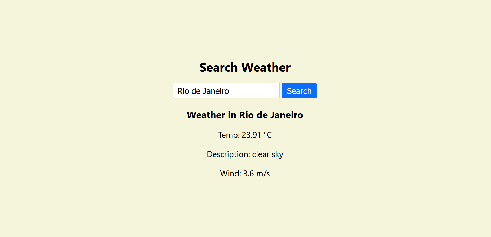

# Weather App

A simple and responsive weather forecast app built with React and the OpenWeather API.

## Features

- Search for weather by city name
- Real-time API integration with [OpenWeather](https://openweathermap.org/)
- Displays temperature, weather conditions, and more
- Responsive and clean UI
- Built with React + Vite

## Preview



## Technologies

- React
- Vite
- CSS
- OpenWeather API

## Getting Started

```bash
# Clone repository
git clone https://github.com/Emanoelkl/react-weather-app.git

cd weather-app

# Install dependencies
npm install
```

### Get API key

- Go to https://openweathermap.org/api
- Create a free account and log in
- Navigate to the "API keys" section in your dashboard
- Copy your default key or create a new one

```bash
# Create .env with your API key
echo "VITE_API_KEY=your_api_key_here" > .env

# Run app
npm run dev
```
